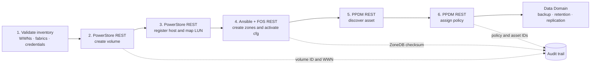
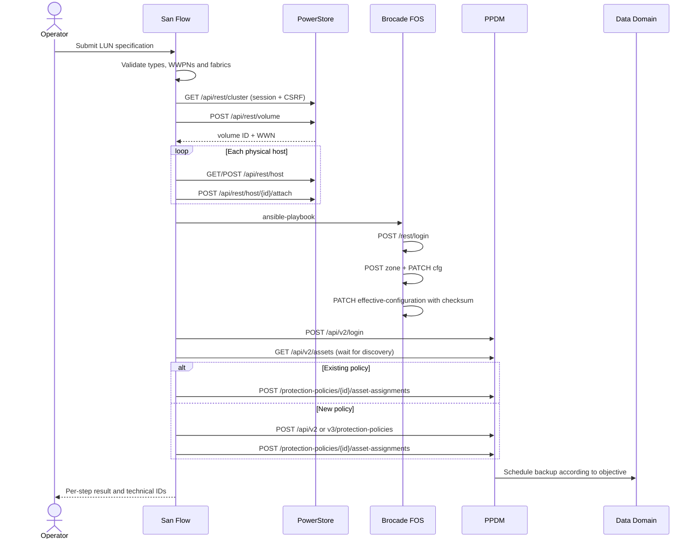
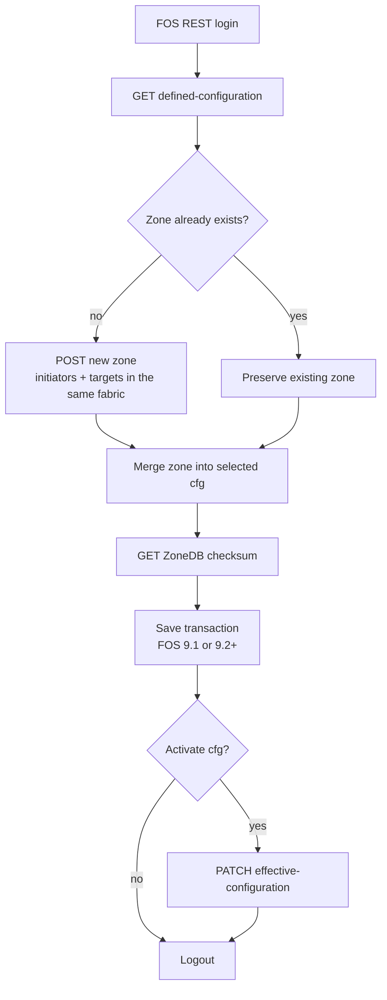
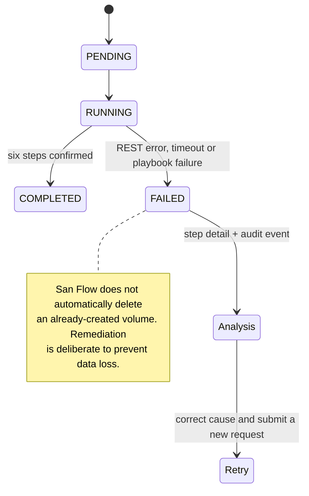
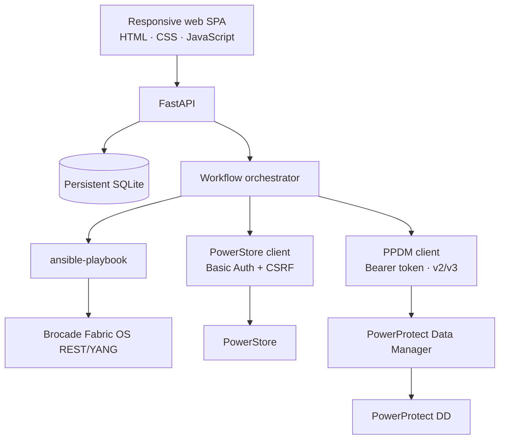

# San Flow

Web control plane for automating, in one workflow, Dell PowerStore volumes or block volume groups, presentation to physical hosts, Fibre Channel zoning on Brocade switches and volume assignment to a protection policy in Dell PowerProtect Data Manager (PPDM).

> Status: initial release ready for lab and acceptance testing. **Dry-run is the default.** Before the first production use, validate the exact PowerStoreOS, PPDM and Fabric OS versions in E-Lab Navigator and run a controlled change.

## End-to-end flow



### API sequence



### Brocade zoning flow



### Failure handling



## What the interface provides

- Registration of PowerStore, PPDM, Brocade switches and physical hosts.
- Multiple WWPNs per equipment entry, separated by fabric and function (`INITIATOR`, `TARGET` or `SWITCH`).
- Live retrieval of PowerStore appliances and policies.
- Live retrieval of PPDM versions, Data Domains, preferred interfaces, storage units and PowerStore policies.
- Creation of PPDM v2 or v3 policies, or assignment to an existing policy.
- Native PowerStore individual-volume and block-volume-group provisioning, including group mapping when supported by PowerStoreOS.
- Native PowerMax Storage Group provisioning through Unisphere REST, with array, SRP, SLO and volume-count parameters.
- PowerStore NAS file-system and share discovery/reconciliation, with PPDM NAS policy assignment through a selected Protection Engine.
- Hourly, daily, weekly or monthly schedules; windows, retention, Retention Lock, consistency and backup level.
- Live inspection of existing policy objectives; Snapshot, Replication and Cloud Tier can be required and defined through version-specific JSON without silently ignoring incomplete selections.
- End-to-end dry-run, live execution and detailed per-step history.
- The application’s own OpenAPI specification at `/docs`.

## Architecture



| Component | Responsibility |
| --- | --- |
| FastAPI | authentication, inventory, live options, workflows and audit events |
| SQLite | inventory, WWNs, execution state and events; persisted in a Docker volume |
| REST clients | sessions, tokens, timeouts, HTTP validation and PPDM v2/v3 compatibility |
| Ansible | idempotent zoning per fabric using only FOS REST calls |
| SPA | registration, provisioning, backup selection and operational tracking |

## Quick start with Docker

Prerequisites: Docker Engine 24+ and Docker Compose v2.

```bash
cp .env.example .env
# edit APP_SECRET_KEY, APP_ADMIN_PASSWORD and the remaining settings
docker compose up --build -d
```

Open `http://localhost:8080`. Service health is available at `GET /health`.

1. Register PowerStore block or PowerStore NAS and its target WWPNs per fabric when block zoning is required.
2. Register each physical host and its initiator WWPNs per fabric.
3. Register the principal switch for each fabric. Provide FID, FOS generation and active cfg.
4. Register PPDM.
5. Use **Test** in the inventory and run the first provisioning in dry-run mode.
6. Review all six steps; only then run a live change window.

See the detailed runbook in [docs/OPERATIONS.md](docs/OPERATIONS.md).

## Repository layout

```text
app/
  api.py                    application endpoints
  models.py                 inventory, WWNs, workflows and audit events
  services/
    powerstore.py           PowerStore REST client
    ppdm.py                 PPDM v2/v3 REST client
    ansible_runner.py       controlled playbook execution
    orchestrator.py         provisioning state machine
  static/                   web interface
playbooks/
  brocade_zoning.yml        FOS REST zoning for 9.1/9.2+
docs/                       architecture, operations, security and references
tests/                      unit tests with mocked APIs
```

## Important guardrails

- Equipment passwords are encrypted with Fernet using a key derived from `APP_SECRET_KEY`.
- Do not change `APP_SECRET_KEY` without planning credential re-encryption first.
- Keep `verify_ssl=true` and install trusted certificates on the appliances. Disabling validation is intended only for controlled labs.
- Use dedicated accounts with the minimum privileges required by the endpoints.
- One principal switch per fabric is sufficient; the ZoneDB is distributed across the fabric.
- Volumes already associated with a local PowerStore policy may be incompatible with PPDM protection depending on the version. Do not combine PPDM-integrated and PowerStore-integrated remote backup.
- Provisioning is progressive and has no automatic destructive rollback. See [docs/SECURITY.md](docs/SECURITY.md) and [docs/OPERATIONS.md](docs/OPERATIONS.md).

## Documentation

- [Architecture and decisions](docs/ARCHITECTURE.md)
- [Operations runbook](docs/OPERATIONS.md)
- [API and integrations](docs/API.md)
- [Security](docs/SECURITY.md)
- [Official references consulted](docs/OFFICIAL_REFERENCES.md)

## Primary official sources

- [Dell PowerStore REST API Developers Guide](https://www.dell.com/support/manuals/en-us/powerstore-1000/pwrstr-apidevg/reference-content?guid=guid-20ffc160-8ff2-45a7-b678-1a5f7bc75569)
- [Dell PowerStore API Developer Portal](https://developer.dell.com/apis/3898/versions/3.2.0/docs/Intro-files/01-Overview/01-The-PowerStore-REST-API.md)
- [PowerProtect Data Manager NAS User Guide](https://www.dell.com/support/manuals/en-us/enterprise-copy-data-management/pp-dm_19.22_nas_ug/powerprotect-data-manager-overview?guid=guid-46a6e468-104c-4c76-9131-46bf666e2191)
- [Dell PowerProtect Data Manager Public REST API](https://developer.dell.com/apis/4378)
- [Dell PPDM Storage Array User Guide](https://www.dell.com/support/manuals/en-us/enterprise-copy-data-management/pp-dm_19.22_storage_array_ug/powerprotect-data-manager-for-storage-arrays?guid=guid-4ea1b71a-e96a-4e53-8c0e-84d4a6d1d258&lang=en-us)
- [Broadcom SAN Design and Best Practices — REST API/YANG](https://docs.broadcom.com/doc/53-1004781)

## License

MIT. See [LICENSE](LICENSE).
