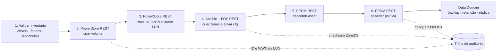
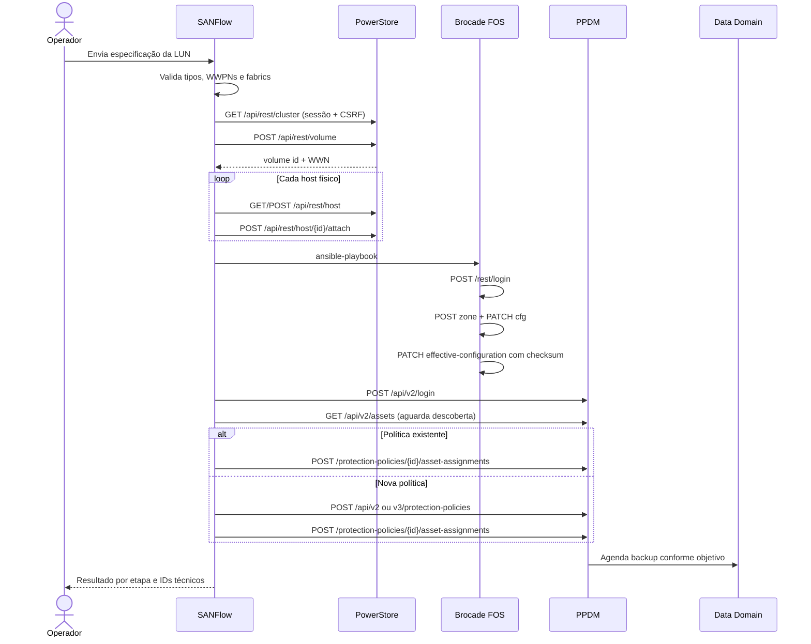
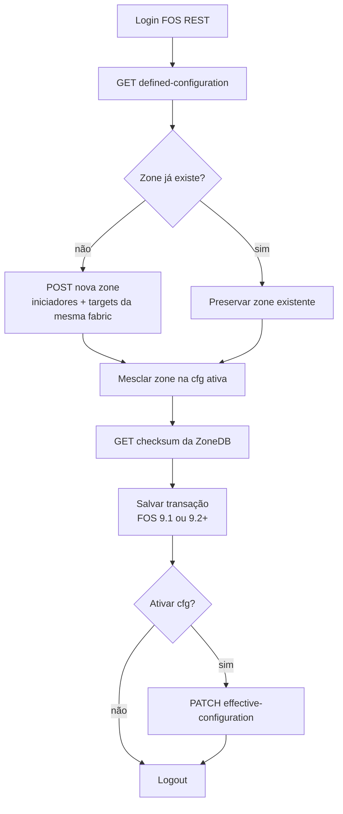
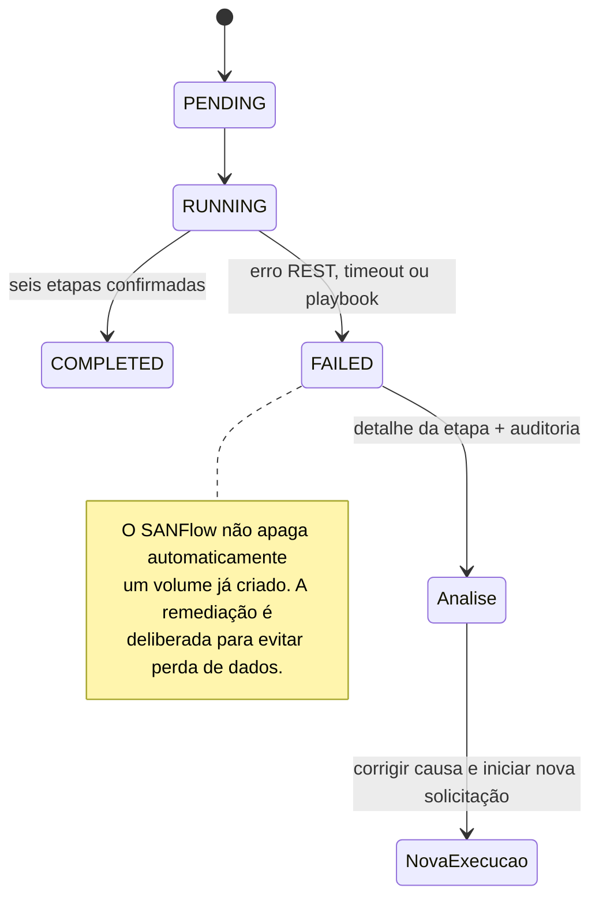
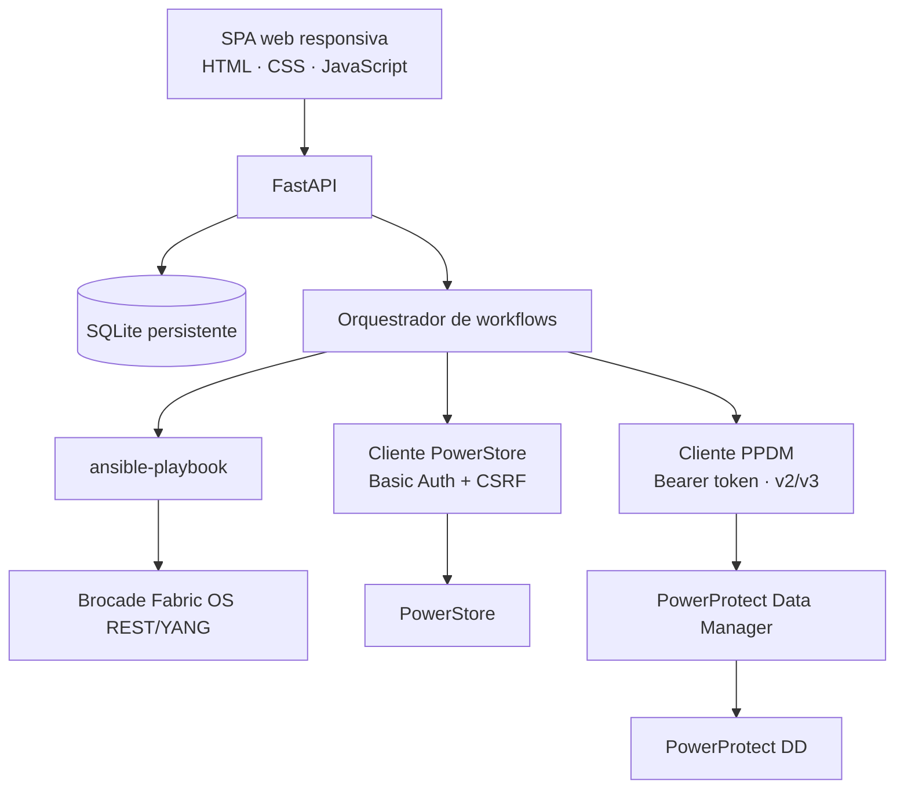

# SANFlow Dell

Control plane web para automatizar, em um único workflow, a criação de LUNs no Dell PowerStore, a apresentação a hosts físicos, o zoning Fibre Channel em switches Brocade e a associação do volume a uma política de proteção no Dell PowerProtect Data Manager (PPDM).

> Estado: versão inicial pronta para laboratório e homologação. O modo **dry-run é o padrão**. Antes do primeiro uso em produção, valide as versões exatas de PowerStoreOS, PPDM e Fabric OS no E-Lab Navigator e execute uma mudança controlada.

## O fluxo completo



### Sequência das APIs



### Fluxo do zoning Brocade



### Tratamento de falhas



## O que a interface entrega

- Cadastro de PowerStore, PPDM, switches Brocade e hosts físicos.
- Cadastro de múltiplos WWPNs por equipamento, separados por fabric e função (`INITIATOR`, `TARGET` ou `SWITCH`).
- Consulta ao vivo de appliances e políticas do PowerStore.
- Consulta ao vivo de versões do PPDM, Data Domains, interfaces preferenciais, storage units e políticas PowerStore.
- Criação de política PPDM v2 ou v3, ou associação a uma política existente.
- Frequência horária, diária, semanal ou mensal; janela, retenção, Retention Lock, consistência e nível de backup.
- Leitura dos objetivos de políticas existentes; snapshot, replicação e Cloud Tier podem ser exigidos e definidos pelo JSON avançado da versão do PPDM, sem ignorar seleções incompletas.
- Dry-run ponta a ponta, execução live e histórico detalhado por etapa.
- OpenAPI da própria ferramenta em `/docs`.

## Arquitetura



| Componente | Responsabilidade |
| --- | --- |
| FastAPI | autenticação, inventário, opções em tempo real, workflows e auditoria |
| SQLite | inventário, WWNs, estado de execução e eventos; persistido em volume Docker |
| Clientes REST | sessões, tokens, timeouts, validação HTTP e compatibilidade PPDM v2/v3 |
| Ansible | zoning idempotente, separado por fabric, usando apenas chamadas REST FOS |
| SPA | cadastro, provisionamento, seleção de backup e acompanhamento operacional |

## Início rápido com Docker

Pré-requisitos: Docker Engine 24+ e Docker Compose v2.

```bash
cp .env.example .env
# edite APP_SECRET_KEY, APP_ADMIN_PASSWORD e os demais parâmetros
docker compose up --build -d
```

Acesse `http://localhost:8080`. A saúde do serviço está em `GET /health`.

1. Cadastre o PowerStore e os WWPNs target por fabric.
2. Cadastre cada host físico e seus WWPNs iniciadores por fabric.
3. Cadastre os switches principais das fabrics A/B. Informe FID, geração FOS e configuração ativa.
4. Cadastre o PPDM.
5. Use **Testar** no inventário e execute o primeiro provisionamento em dry-run.
6. Revise as seis etapas; somente então execute uma janela em modo live.

Veja o runbook detalhado em [docs/OPERATIONS.md](docs/OPERATIONS.md).

## Estrutura do repositório

```text
app/
  api.py                    endpoints da aplicação
  models.py                 inventário, WWNs, workflows e auditoria
  services/
    powerstore.py           cliente REST PowerStore
    ppdm.py                 cliente REST PPDM v2/v3
    ansible_runner.py       execução controlada do playbook
    orchestrator.py         máquina de estados do provisionamento
  static/                   interface web
playbooks/
  brocade_zoning.yml        zoning FOS REST 9.1/9.2+
docs/                       arquitetura, operação, segurança e referências
tests/                      testes unitários com APIs simuladas
```

## Guardrails importantes

- As senhas dos equipamentos são cifradas com Fernet usando uma chave derivada de `APP_SECRET_KEY`.
- Nunca troque `APP_SECRET_KEY` sem antes planejar a recifragem das credenciais existentes.
- Mantenha `verify_ssl=true` e instale certificados confiáveis nos appliances. A opção de desabilitar validação existe apenas para laboratórios controlados.
- Use contas dedicadas, com privilégios mínimos compatíveis com os endpoints necessários.
- Um switch principal por fabric é suficiente; a ZoneDB é distribuída pela fabric.
- Volumes já associados a uma política local do PowerStore podem ser incompatíveis com proteção PPDM, conforme a versão. Não combine a integração PPDM com remote backup configurado diretamente pelo PowerStore.
- A criação é progressiva e não possui rollback destrutivo automático. Consulte [docs/SECURITY.md](docs/SECURITY.md) e [docs/OPERATIONS.md](docs/OPERATIONS.md).

## Documentação

- [Arquitetura e decisões](docs/ARCHITECTURE.md)
- [Runbook operacional](docs/OPERATIONS.md)
- [API e integrações](docs/API.md)
- [Segurança](docs/SECURITY.md)
- [Referências oficiais consultadas](docs/OFFICIAL_REFERENCES.md)

## Fontes oficiais principais

- [Dell PowerStore REST API Developers Guide](https://www.dell.com/support/manuals/en-us/powerstore-1000/pwrstr-apidevg/reference-content?guid=guid-20ffc160-8ff2-45a7-b678-1a5f7bc75569)
- [Dell PowerStore API no Developer Portal](https://developer.dell.com/apis/3898/versions/3.2.0/docs/Intro-files/01-Overview/01-The-PowerStore-REST-API.md)
- [Dell PowerProtect Data Manager Public REST API](https://developer.dell.com/apis/4378)
- [Dell PPDM Storage Array User Guide](https://www.dell.com/support/manuals/en-us/enterprise-copy-data-management/pp-dm_19.22_storage_array_ug/powerprotect-data-manager-for-storage-arrays?guid=guid-4ea1b71a-e96a-4e53-8c0e-84d4a6d1d258&lang=en-us)
- [Broadcom SAN Design and Best Practices — REST API/YANG](https://docs.broadcom.com/doc/53-1004781)

## Licença

MIT. Consulte [LICENSE](LICENSE).
