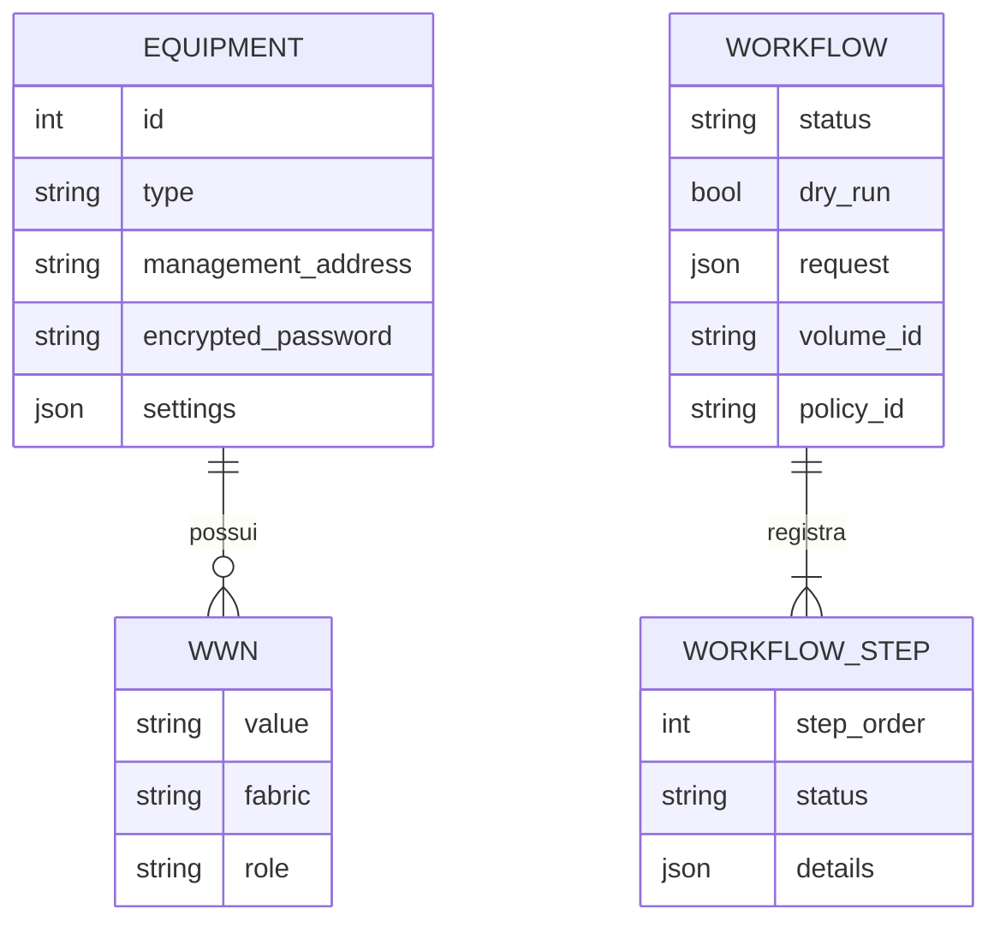

# Arquitetura

## Escopo

O SANFlow é um control plane, não um data plane. Ele coordena os sistemas de gerenciamento; o tráfego de I/O e de backup continua fluindo diretamente entre hosts, PowerStore e PowerProtect DD.

Neste escopo, “apresentar a LUN” significa registrar/reconciliar os WWPNs do host no PowerStore, criar o mapping e configurar o zoning nas fabrics. O rescan SCSI, multipath e filesystem dentro do sistema operacional permanecem como atividade do host e não exigem que o SANFlow mantenha credenciais SSH dos servidores.

## Domínios

1. **Inventário:** equipamentos, endpoints, credenciais cifradas, configurações específicas e WWNs.
2. **Descoberta:** leitura em tempo real de opções PowerStore e PPDM.
3. **Orquestração:** workflow persistente, sequencial e auditado.
4. **Integrações:** clientes REST com sessões, TLS, timeout e erros normalizados.
5. **Zoning:** processo Ansible separado, com inventário temporário apagado ao terminar.
6. **Interface:** SPA sem toolchain Node, servida pelo mesmo container.

## Modelo de dados

## Idempotência

- O cadastro usa nomes únicos e WWNs únicos dentro do equipamento.
- Hosts existentes no PowerStore são reutilizados por `powerstore_host_id` ou nome.
- Mappings existentes entre o host e o volume são reconhecidos.
- O playbook consulta a configuração definida, não recria zones existentes e preserva os membros da cfg.
- A associação PPDM é executada após a descoberta do asset. Uma nova execução deve usar política existente ou um novo nome de política para evitar duplicidade.

## Consistência e compensação

Não há transação distribuída entre os quatro produtos. Cada etapa é confirmada antes da seguinte. Se uma etapa posterior falhar, recursos anteriores permanecem e seus IDs ficam no workflow. Isso evita que um rollback automático apague uma LUN que já possa ter sido detectada por um host.

## Compatibilidade

- PowerStore: URI base `/api/rest`, com token `DELL-EMC-TOKEN` para mutações.
- PPDM: login v2; políticas v2 até 19.16 e v3 a partir de 19.17, seguindo a transição publicada pela Dell.
- Fabric OS: login REST, módulo YANG `brocade-zone`, checksum ZoneDB e ações diferentes para FOS 9.1 e 9.2+.
